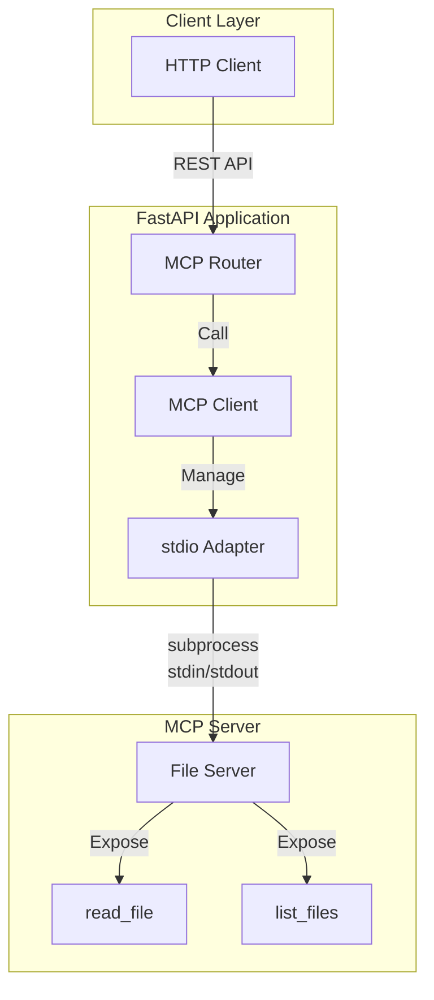

# MCP Web Application

A production-ready web application demonstrating Model Context Protocol (MCP) integration with FastAPI. This project showcases how to build, integrate, and deploy custom MCP servers for AI-powered tool usage.

[](https://opensource.org/licenses/MIT)
[](https://www.python.org/)
[](https://www.docker.com/)
[](https://fastapi.tiangolo.com/)

## 📋 Overview

This project is a comprehensive learning resource and production template for building MCP-enabled web applications. It includes:

- **Custom MCP Server**: File operations server with `read_file` and `list_files` tools
- **FastAPI Integration**: RESTful API for MCP tool invocation
- **stdio Adapter**: Robust subprocess-based MCP communication
- **Docker Deployment**: Containerized for consistent environments
- **Comprehensive Documentation**: From basics to production deployment

### What is MCP?

Model Context Protocol (MCP) is an open protocol that standardizes how applications provide context to Large Language Models (LLMs). It enables:
- **Tool Usage**: LLMs can call external functions
- **Resource Access**: Structured data exposure to AI models
- **Prompt Templates**: Reusable interaction patterns

Learn more: [Model Context Protocol Specification](https://modelcontextprotocol.io/)

## 🌟 Features

### Core Functionality
- ✅ **Custom MCP Server**: Python-based file operations server
- ✅ **FastAPI REST API**: HTTP endpoints for MCP tools
- ✅ **stdio Transport**: Subprocess-based server communication
- ✅ **UTF-8 Support**: Full Unicode handling for cross-platform compatibility
- ✅ **Error Handling**: Comprehensive error management and logging
- ✅ **Health Checks**: Built-in monitoring endpoints

### Development Features
- 🐳 **Docker Ready**: Multi-stage Dockerfile for optimized images
- 📝 **API Documentation**: Auto-generated with FastAPI/Swagger
- 🧪 **Test Suite**: Unit and integration tests
- 🔒 **Security**: Non-root container execution
- 📊 **Monitoring**: Health checks and logging

### Documentation
- 📚 **Learning Guides**: Step-by-step MCP concepts
- 🚀 **Deployment Guide**: Production deployment instructions
- 👥 **Team Guide**: Onboarding and contribution guidelines
- 🔧 **API Specification**: Complete endpoint documentation

## 🚀 Quick Start

### Prerequisites

- Python 3.11+
- Docker 20.10+ (for containerized deployment)
- Git

### Installation

#### Option 1: Docker (Recommended)

```bash
# Clone the repository
git clone https://github.com/your-username/mcp-web-app.git
cd mcp-web-app

# Build and run
.\06-deployment\build-and-run.ps1
```

#### Option 2: Local Development

```bash
# Clone and setup
git clone https://github.com/your-username/mcp-web-app.git
cd mcp-web-app

# Create virtual environment
python -m venv .venv
.\.venv\Scripts\Activate.ps1  # Windows
# source .venv/bin/activate    # Linux/Mac

# Install dependencies
cd 04-app-integration/simple-webapp
pip install -r requirements.txt

# Run the application
uvicorn app.main:app --reload --port 8000
```

### Verify Installation

```bash
# Health check
curl http://localhost:8000/mcp/health

# List available tools
curl http://localhost:8000/mcp/tools

# API documentation (browser)
open http://localhost:8000/docs
```

## 📚 Architecture



### Key Components

| Component | Description | Location |
|-----------|-------------|----------|
| **FastAPI App** | Web server and API layer | `04-app-integration/simple-webapp/app/` |
| **MCP Client** | Manages MCP server communication | `app/services/mcp_client.py` |
| **stdio Adapter** | Subprocess-based transport | `app/services/mcp_client.py` |
| **File Server** | Custom MCP server | `05-build-server/file_server.py` |

## 🔧 API Endpoints

### Health & Tools

| Endpoint | Method | Description |
|----------|--------|-------------|
| `/mcp/health` | GET | Health check |
| `/mcp/tools` | GET | List available MCP tools |

### Tool Invocation

| Endpoint | Method | Description |
|----------|--------|-------------|
| `/mcp/actions/read_file` | POST | Read file contents |
| `/mcp/actions/list_files` | POST | List directory contents |

### Example: Read File

```bash
curl -X POST http://localhost:8000/mcp/actions/read_file \
  -H "Content-Type: application/json" \
  -d '{
    "params": {
      "path": "/app/test_samples/sample1.txt"
    }
  }'
```

Response:
```json
{
  "tool": "read_file",
  "data": {
    "text": "Hello, MCP File Server!..."
  },
  "latency_ms": 12,
  "success": true
}
```

### Example: List Files

```bash
curl -X POST http://localhost:8000/mcp/actions/list_files \
  -H "Content-Type: application/json" \
  -d '{
    "params": {
      "directory": "/app/test_samples",
      "pattern": "*.txt"
    }
  }'
```

See [API_SPEC.md](API_SPEC.md) for complete documentation.

## 📖 Documentation

| Document | Description |
|----------|-------------|
| [DEPLOYMENT_GUIDE.md](DEPLOYMENT_GUIDE.md) | Production deployment instructions |
| [TEAM_GUIDE.md](TEAM_GUIDE.md) | Team onboarding and contribution |
| [API_SPEC.md](API_SPEC.md) | Complete API reference |
| [CHANGELOG.md](../CHANGELOG.md) | Version history |

### Learning Resources

Located in `docs/`:
- `20251130_M6_MCP_서버_구조_분석.md` - MCP server architecture
- `20251130_MCP_데코레이터_상세_가이드.md` - @mcp.tool() decorator guide
- `20251130_JSON-RPC_개념_가이드.md` - JSON-RPC protocol
- `20251130_stdio_transport_타입힌트_가이드.md` - stdio transport

## 🛠️ Development

### Project Structure

```
MCP_Basic_Higher_Models_GC/
├── 01-foundations/          # MCP concepts and terminology
├── 02-env-setup/            # Environment setup scripts
├── 03-discover-servers/     # Server discovery examples
├── 04-app-integration/      # FastAPI web application
│   └── simple-webapp/
│       ├── app/             # Application code
│       ├── config/          # Configuration files
│       └── scripts/         # Test scripts
├── 05-build-server/         # Custom MCP server
│   ├── file_server.py       # File operations server
│   └── test_samples/        # Test data
├── 06-deployment/           # Docker deployment
│   ├── Dockerfile           # Container definition
│   ├── docker-compose.yml   # Service orchestration
│   └── *.ps1                # Build/test scripts
├── 07-release-share/        # Documentation & templates
│   ├── PROJECT_TEMPLATE/    # Reusable template
│   └── EXAMPLES/            # Usage examples
└── docs/                    # Learning documentation
```

### Running Tests

```bash
# Unit tests (direct server)
cd 05-build-server
python test_direct.py

# Integration tests (FastAPI)
cd 04-app-integration/simple-webapp
python -m pytest

# Docker integration tests
.\06-deployment\test-docker.ps1
```

### Contributing

We welcome contributions! Please see [TEAM_GUIDE.md](TEAM_GUIDE.md) for:
- Development setup
- Coding standards
- Pull request process
- Testing requirements

## 🔒 Security

### Best Practices Implemented

- ✅ **Non-root Execution**: Container runs as `mcpuser` (UID 1000)
- ✅ **No Secrets in Code**: Environment variables for configuration
- ✅ **Input Validation**: Pydantic models validate all inputs
- ✅ **Error Sanitization**: Stack traces not exposed to clients
- ✅ **Read-only Volumes**: Test samples mounted read-only

### Security Considerations

For production deployment:
1. Use secrets management (Docker Secrets, Vault, etc.)
2. Enable TLS/HTTPS with reverse proxy
3. Implement rate limiting
4. Add authentication/authorization
5. Regular security audits and updates

See [DEPLOYMENT_GUIDE.md](DEPLOYMENT_GUIDE.md) for details.

## 📊 Performance

### Benchmarks

| Operation | Latency (p50) | Latency (p99) |
|-----------|---------------|---------------|
| Health Check | 2 ms | 8 ms |
| List Tools | 5 ms | 15 ms |
| Read File (1KB) | 12 ms | 25 ms |
| List Files (10 items) | 10 ms | 20 ms |

*Tested on: Windows 11, Docker Desktop, 8GB RAM, i7 CPU*

### Resource Usage

- **Memory**: ~100 MB (container)
- **CPU**: <5% idle, <30% under load
- **Disk**: ~200 MB (image size)

## 🤝 Acknowledgments

This project was developed as part of MCP learning series:
- **M1-M5**: Foundation, environment, server discovery, web app, integration
- **M6**: Custom MCP server development
- **M7**: Deployment and documentation (current)
- **M8**: Capstone project (upcoming)

Special thanks to:
- [Anthropic](https://www.anthropic.com/) for the MCP specification
- [FastAPI](https://fastapi.tiangolo.com/) framework team
- Open source community

## 📄 License

This project is licensed under the MIT License - see the [LICENSE](../LICENSE) file for details.

## 📞 Support

- **Issues**: [GitHub Issues](https://github.com/your-username/mcp-web-app/issues)
- **Discussions**: [GitHub Discussions](https://github.com/your-username/mcp-web-app/discussions)
- **Documentation**: Check `docs/` folder for learning guides

## 🗺️ Roadmap

### Completed
- ✅ M1: MCP concepts and terminology
- ✅ M2: Local environment setup
- ✅ M3: Server discovery and evaluation
- ✅ M4: FastAPI web application skeleton
- ✅ M5: MCP server integration
- ✅ M6: Custom file operations server
- ✅ M7: Docker deployment and documentation

### Upcoming
- ⏳ M8: Capstone project with real-world use case
- 🔮 Advanced features (WebSocket transport, resource endpoints)
- 🔮 CI/CD pipeline (GitHub Actions)
- 🔮 Monitoring and observability (Prometheus, Grafana)
- 🔮 Multi-server orchestration

## ⭐ Star History

If you find this project useful, please consider giving it a star!

---

**Built with ❤️ using MCP, FastAPI, and Docker**

**Last Updated**: 2025-12-07
**Version**: 1.0.0
