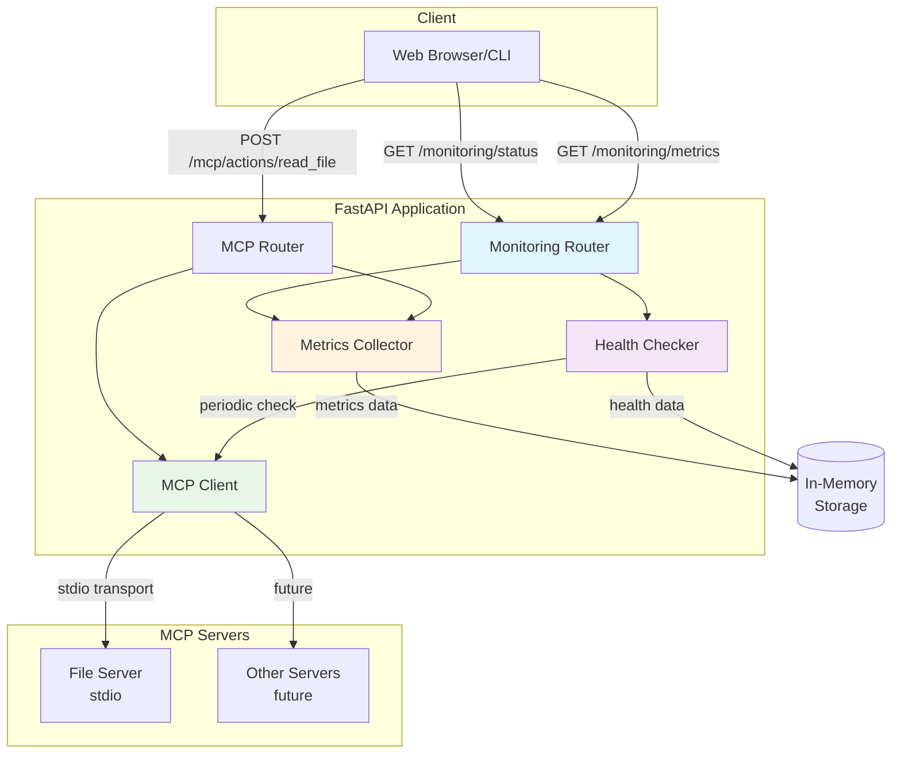
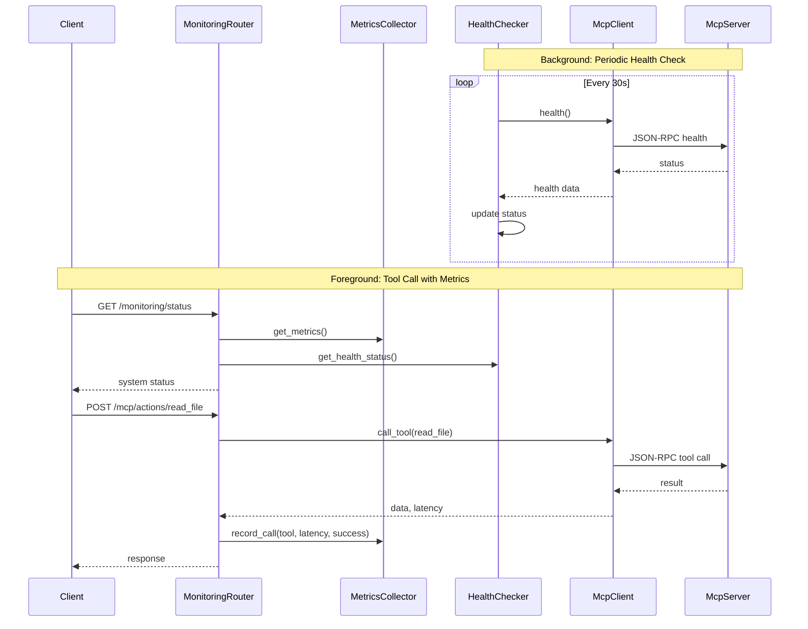
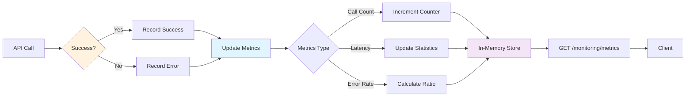

# M8 Capstone: 실시간 모니터링 시스템 설계

**프로젝트**: MCP Web Application - Monitoring System
**작성일**: 2025-12-14
**작성자**: Claude Sonnet 4.5 (Anthropic)
**버전**: 1.0.0

---

## 📋 목차

1. [개요](#개요)
2. [요구사항](#요구사항)
3. [아키텍처](#아키텍처)
4. [컴포넌트 설계](#컴포넌트-설계)
5. [API 명세](#api-명세)
6. [데이터 모델](#데이터-모델)
7. [구현 전략](#구현-전략)
8. [테스트 전략](#테스트-전략)

---

## 개요

### 프로젝트 목적

MCP(Model Context Protocol) 서버의 상태와 성능을 실시간으로 모니터링하는 시스템을 구축합니다. 이 시스템은 프로덕션 환경에서 MCP 기반 애플리케이션의 안정성과 성능을 보장하는 데 필수적입니다.

### 핵심 가치

1. **가시성 (Visibility)**: 시스템 상태를 한눈에 파악
2. **신뢰성 (Reliability)**: 장애를 빠르게 감지하고 대응
3. **성능 (Performance)**: 병목 지점을 식별하고 최적화
4. **운영성 (Operability)**: 실시간 모니터링으로 운영 효율성 향상

### 시나리오

**사용자 스토리:**
> DevOps 엔지니어로서, 나는 MCP 서버의 상태를 실시간으로 모니터링하고 싶다.
> 서버가 정상 동작하는지, 응답 시간은 얼마나 걸리는지, 에러율은 얼마나 되는지
> 한눈에 파악할 수 있어야 한다.

---

## 요구사항

### 기능 요구사항 (Functional Requirements)

#### FR-1: 시스템 상태 조회
- **설명**: 전체 시스템의 현재 상태를 조회
- **입력**: 없음
- **출력**: 시스템 상태 요약 (상태, 가동 시간, 서버 수 등)
- **엔드포인트**: `GET /monitoring/status`

#### FR-2: 성능 메트릭 조회
- **설명**: 수집된 성능 메트릭 데이터 조회
- **입력**: 없음 (선택: 시간 범위, 도구 필터)
- **출력**: 도구별 호출 횟수, 평균 응답 시간, 성공/실패율
- **엔드포인트**: `GET /monitoring/metrics`

#### FR-3: 서버 헬스 체크
- **설명**: 특정 MCP 서버의 헬스 상태 확인
- **입력**: 서버 이름
- **출력**: 헬스 상태 (ok, degraded, error), 마지막 체크 시간
- **엔드포인트**: `GET /monitoring/health/{server}`

#### FR-4: 메트릭 리셋 (선택)
- **설명**: 수집된 메트릭 데이터 초기화
- **입력**: 없음 (또는 확인 플래그)
- **출력**: 리셋 성공 여부
- **엔드포인트**: `POST /monitoring/reset`

### 비기능 요구사항 (Non-Functional Requirements)

#### NFR-1: 성능
- 모니터링 API 응답 시간 < 100ms
- 메트릭 수집 오버헤드 < 5ms
- 메모리 사용량 < 100MB

#### NFR-2: 신뢰성
- 모니터링 시스템 장애가 메인 시스템에 영향 없음
- 헬스 체크 실패 시 자동 재시도 (최대 3회)
- 에러 발생 시 적절한 폴백

#### NFR-3: 확장성
- 여러 MCP 서버 동시 모니터링 지원
- 메트릭 데이터 저장소 교체 가능 (인메모리 → DB)
- 새로운 메트릭 타입 추가 용이

#### NFR-4: 보안
- 모니터링 API에 인증 추가 가능 (선택)
- 민감 정보 노출 방지
- 메트릭 리셋은 관리자만 실행 가능 (선택)

---

## 아키텍처

### 전체 아키텍처



### 컴포넌트 간 상호작용



### 데이터 흐름



---

## 컴포넌트 설계

### 1. MetricsCollector

**책임 (Responsibility):**
- API 호출 메트릭 수집 및 저장
- 도구별 통계 계산
- 스레드 안전한 데이터 접근

**인터페이스:**

```python
class MetricsCollector:
    """
    API 호출 메트릭을 수집하고 관리하는 클래스

    Attributes:
        _metrics: 도구별 메트릭 데이터 (Dict)
        _lock: 스레드 안전성을 위한 Lock
        _start_time: 시스템 시작 시간
    """

    def __init__(self) -> None:
        """메트릭 수집기 초기화"""

    def record_call(
        self,
        tool: str,
        latency_ms: int,
        success: bool = True
    ) -> None:
        """
        API 호출 기록

        Args:
            tool: 도구 이름
            latency_ms: 응답 시간 (밀리초)
            success: 성공 여부
        """

    def get_metrics(self) -> Dict[str, Any]:
        """
        전체 메트릭 데이터 조회

        Returns:
            메트릭 데이터 딕셔너리
        """

    def get_tool_stats(self, tool: str) -> Optional[Dict[str, Any]]:
        """
        특정 도구의 통계 조회

        Args:
            tool: 도구 이름

        Returns:
            도구 통계 또는 None
        """

    def reset_metrics(self) -> None:
        """모든 메트릭 초기화"""

    def get_uptime_seconds(self) -> int:
        """시스템 가동 시간 (초) 반환"""
```

**데이터 구조:**

```python
{
    "read_file": {
        "total_calls": 150,
        "success_calls": 148,
        "error_calls": 2,
        "success_rate": 0.9867,
        "total_latency_ms": 4500,
        "avg_latency_ms": 30.0,
        "min_latency_ms": 15,
        "max_latency_ms": 120,
        "last_call_time": "2025-12-14T10:30:45Z"
    },
    "list_files": {
        # ... similar structure
    }
}
```

### 2. HealthChecker

**책임:**
- MCP 서버 헬스 상태 주기적 확인
- 장애 감지 및 복구 모니터링
- 백그라운드 스레드 관리

**인터페이스:**

```python
class HealthChecker:
    """
    MCP 서버의 헬스 상태를 주기적으로 확인하는 클래스

    Attributes:
        _health_data: 서버별 헬스 데이터
        _lock: 스레드 안전성을 위한 Lock
        _thread: 백그라운드 스레드
        _running: 실행 상태 플래그
        _interval: 체크 주기 (초)
    """

    def __init__(self, interval_seconds: int = 30) -> None:
        """
        헬스 체커 초기화

        Args:
            interval_seconds: 체크 주기 (기본 30초)
        """

    def start_monitoring(self) -> None:
        """백그라운드 모니터링 시작"""

    def stop_monitoring(self) -> None:
        """백그라운드 모니터링 중지"""

    def get_health_status(self, server_name: str) -> Optional[Dict[str, Any]]:
        """
        특정 서버의 헬스 상태 조회

        Args:
            server_name: 서버 이름

        Returns:
            헬스 상태 또는 None
        """

    def get_all_health_status(self) -> List[Dict[str, Any]]:
        """모든 서버의 헬스 상태 조회"""

    def _check_health(self) -> None:
        """헬스 체크 실행 (내부 메서드)"""
```

**헬스 상태 판단 로직:**

```python
# 상태 정의
- "ok": 정상 (응답 < timeout)
- "degraded": 저하 (응답 느림 또는 1회 실패)
- "error": 에러 (연속 3회 실패)

# 상태 전이
ok → degraded: 타임아웃 또는 1회 실패
degraded → error: 연속 2회 추가 실패
degraded → ok: 정상 응답
error → degraded: 정상 응답 (복구 시작)
```

**데이터 구조:**

```python
{
    "server_name": "file_server",
    "status": "ok",  # ok | degraded | error
    "last_check_time": "2025-12-14T10:30:45Z",
    "last_success_time": "2025-12-14T10:30:45Z",
    "consecutive_failures": 0,
    "total_checks": 120,
    "total_successes": 118,
    "total_failures": 2,
    "uptime_percentage": 98.33,
    "response_time_ms": 25
}
```

### 3. MonitoringRouter

**책임:**
- 모니터링 API 엔드포인트 제공
- MetricsCollector, HealthChecker 조율
- 응답 데이터 포맷팅

**엔드포인트:**

```python
@router.get("/monitoring/status")
async def get_system_status() -> SystemStatusResponse:
    """전체 시스템 상태 요약"""

@router.get("/monitoring/metrics")
async def get_metrics(
    tool: Optional[str] = None
) -> MetricsResponse:
    """성능 메트릭 조회"""

@router.get("/monitoring/health/{server}")
async def get_server_health(
    server: str
) -> HealthResponse:
    """특정 서버 헬스 체크"""

@router.post("/monitoring/reset")
async def reset_metrics() -> ResetResponse:
    """메트릭 리셋"""
```

---

## API 명세

### 1. GET /monitoring/status

**설명**: 전체 시스템 상태 요약

**요청:**
```http
GET /monitoring/status HTTP/1.1
Host: localhost:8000
```

**응답 (200 OK):**
```json
{
  "status": "ok",
  "timestamp": "2025-12-14T10:30:45Z",
  "uptime_seconds": 3600,
  "servers": [
    {
      "name": "file_server",
      "status": "ok",
      "type": "stdio",
      "last_check": "2025-12-14T10:30:40Z"
    }
  ],
  "metrics_summary": {
    "total_calls": 200,
    "total_successes": 195,
    "total_errors": 5,
    "success_rate": 0.975,
    "avg_latency_ms": 35
  }
}
```

### 2. GET /monitoring/metrics

**설명**: 성능 메트릭 상세 조회

**요청:**
```http
GET /monitoring/metrics?tool=read_file HTTP/1.1
Host: localhost:8000
```

**응답 (200 OK):**
```json
{
  "timestamp": "2025-12-14T10:30:45Z",
  "uptime_seconds": 3600,
  "tools": [
    {
      "name": "read_file",
      "total_calls": 150,
      "success_calls": 148,
      "error_calls": 2,
      "success_rate": 0.9867,
      "avg_latency_ms": 30.0,
      "min_latency_ms": 15,
      "max_latency_ms": 120,
      "last_call_time": "2025-12-14T10:30:45Z"
    },
    {
      "name": "list_files",
      "total_calls": 50,
      "success_calls": 47,
      "error_calls": 3,
      "success_rate": 0.94,
      "avg_latency_ms": 60.0,
      "min_latency_ms": 30,
      "max_latency_ms": 200,
      "last_call_time": "2025-12-14T10:29:30Z"
    }
  ]
}
```

### 3. GET /monitoring/health/{server}

**설명**: 특정 서버 헬스 상태

**요청:**
```http
GET /monitoring/health/file_server HTTP/1.1
Host: localhost:8000
```

**응답 (200 OK):**
```json
{
  "server_name": "file_server",
  "status": "ok",
  "last_check_time": "2025-12-14T10:30:45Z",
  "last_success_time": "2025-12-14T10:30:45Z",
  "consecutive_failures": 0,
  "total_checks": 120,
  "total_successes": 118,
  "total_failures": 2,
  "uptime_percentage": 98.33,
  "response_time_ms": 25,
  "server_info": {
    "type": "stdio",
    "exec_path": "python file_server.py"
  }
}
```

**에러 응답 (404 Not Found):**
```json
{
  "error": {
    "code": "server_not_found",
    "message": "Server 'unknown_server' not found"
  }
}
```

### 4. POST /monitoring/reset

**설명**: 메트릭 데이터 초기화

**요청:**
```http
POST /monitoring/reset HTTP/1.1
Host: localhost:8000
Content-Type: application/json

{
  "confirm": true
}
```

**응답 (200 OK):**
```json
{
  "success": true,
  "message": "Metrics reset successfully",
  "timestamp": "2025-12-14T10:30:45Z",
  "previous_metrics": {
    "total_calls": 200,
    "total_successes": 195,
    "total_errors": 5
  }
}
```

---

## 데이터 모델

### Pydantic Models

```python
from pydantic import BaseModel, Field
from typing import List, Optional
from datetime import datetime

class ToolMetrics(BaseModel):
    """도구별 메트릭 데이터"""
    name: str
    total_calls: int
    success_calls: int
    error_calls: int
    success_rate: float
    avg_latency_ms: float
    min_latency_ms: int
    max_latency_ms: int
    last_call_time: Optional[str] = None

class MetricsSummary(BaseModel):
    """메트릭 요약"""
    total_calls: int
    total_successes: int
    total_errors: int
    success_rate: float
    avg_latency_ms: float

class ServerHealth(BaseModel):
    """서버 헬스 상태"""
    name: str
    status: str  # ok | degraded | error
    type: str
    last_check: str

class SystemStatusResponse(BaseModel):
    """시스템 상태 응답"""
    status: str
    timestamp: str
    uptime_seconds: int
    servers: List[ServerHealth]
    metrics_summary: MetricsSummary

class MetricsResponse(BaseModel):
    """메트릭 조회 응답"""
    timestamp: str
    uptime_seconds: int
    tools: List[ToolMetrics]

class HealthResponse(BaseModel):
    """헬스 체크 응답"""
    server_name: str
    status: str
    last_check_time: str
    last_success_time: Optional[str]
    consecutive_failures: int
    total_checks: int
    total_successes: int
    total_failures: int
    uptime_percentage: float
    response_time_ms: int
    server_info: Optional[dict] = None

class ResetRequest(BaseModel):
    """메트릭 리셋 요청"""
    confirm: bool = True

class ResetResponse(BaseModel):
    """메트릭 리셋 응답"""
    success: bool
    message: str
    timestamp: str
    previous_metrics: MetricsSummary
```

---

## 구현 전략

### Phase 1: 메트릭 수집기 구현
1. `MetricsCollector` 클래스 작성
2. 스레드 안전성 확보 (Lock 사용)
3. 단위 테스트 작성
4. 기존 MCP 라우터에 통합 (선택)

### Phase 2: 헬스 체커 구현
1. `HealthChecker` 클래스 작성
2. 백그라운드 스레드 구현
3. 헬스 체크 로직 구현
4. 단위 테스트 작성

### Phase 3: 모니터링 라우터 구현
1. `MonitoringRouter` 작성
2. API 엔드포인트 구현
3. Pydantic 모델 정의
4. 통합 테스트 작성

### Phase 4: 통합 및 테스트
1. 전체 시스템 통합
2. E2E 테스트
3. 데모 스크립트 작성
4. 문서화

---

## 테스트 전략

### 단위 테스트 (Unit Tests)

**테스트 대상:**
- `MetricsCollector`: 메트릭 기록, 조회, 리셋
- `HealthChecker`: 헬스 체크 로직, 상태 전이

**테스트 케이스:**
```python
# MetricsCollector
- test_record_call_increments_counter
- test_calculate_success_rate
- test_calculate_avg_latency
- test_reset_metrics
- test_thread_safety

# HealthChecker
- test_health_check_success
- test_health_check_timeout
- test_consecutive_failures
- test_status_transitions
- test_background_thread
```

### 통합 테스트 (Integration Tests)

**테스트 시나리오:**
1. 시스템 시작 → 모니터링 API 호출 → 초기 상태 확인
2. MCP 도구 호출 → 메트릭 업데이트 확인
3. 여러 도구 호출 → 통계 계산 확인
4. 서버 장애 시뮬레이션 → 헬스 상태 변화 확인

### E2E 테스트 (End-to-End Tests)

**데모 시나리오:**
1. FastAPI 서버 시작
2. 초기 상태 확인 (`/monitoring/status`)
3. 10회 API 호출 (read_file, list_files)
4. 메트릭 조회 (`/monitoring/metrics`)
5. 헬스 체크 (`/monitoring/health/file_server`)
6. 결과 분석 및 검증

---

## 성능 고려사항

### 메트릭 수집 오버헤드
- **목표**: < 5ms
- **전략**:
  - 인메모리 저장 (DB 접근 없음)
  - 최소한의 계산 (평균은 미리 계산)
  - Lock 최소화 (읽기는 Lock 없이)

### 헬스 체크 주기
- **기본값**: 30초
- **조정 가능**: 환경 변수로 설정
- **타임아웃**: 10초 (MCP 서버 응답)

### 메모리 사용량
- **예상**: < 100MB
- **전략**:
  - 메트릭 데이터만 저장 (원시 데이터 X)
  - 히스토리 제한 (옵션)
  - 주기적 정리 (선택)

---

## 향후 개선 방향

### 단기 (M8 이후)
1. **WebSocket 실시간 스트리밍**: 메트릭 변화를 실시간으로 푸시
2. **메트릭 영속성**: PostgreSQL 또는 InfluxDB 연동
3. **알림 시스템**: 임계값 초과 시 알림 (이메일, Slack)

### 중기
1. **프론트엔드 대시보드**: React/Vue.js로 시각화
2. **분산 추적**: OpenTelemetry 통합
3. **멀티 서버 관리**: 여러 MCP 서버 동시 모니터링

### 장기
1. **머신러닝 기반 이상 탐지**: 자동 장애 예측
2. **자동 스케일링 연동**: Kubernetes HPA 트리거
3. **커스텀 메트릭**: 사용자 정의 메트릭 추가

---

## 참고 문서

- [FastAPI Background Tasks](https://fastapi.tiangolo.com/tutorial/background-tasks/)
- [Prometheus Best Practices](https://prometheus.io/docs/practices/)
- [Observability Engineering](https://www.oreilly.com/library/view/observability-engineering/9781492076438/)
- [Site Reliability Engineering](https://sre.google/)

---

**문서 버전**: 1.0.0
**마지막 업데이트**: 2025-12-14
**다음 단계**: 구현 시작 (Phase 1)
