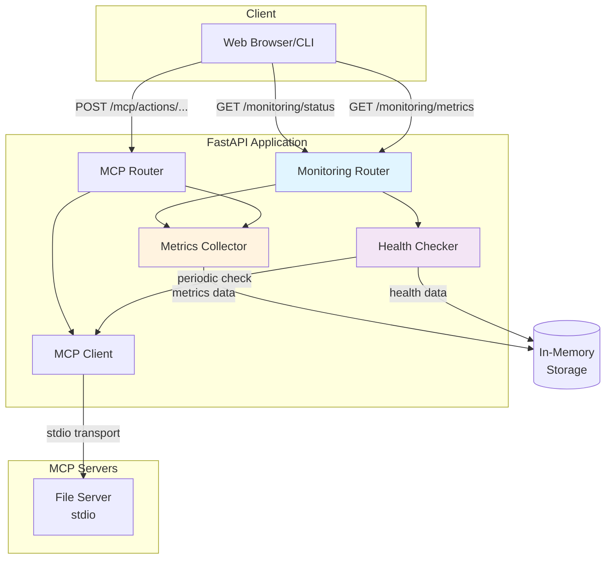

# M8 Capstone: 실시간 MCP 모니터링 시스템

**프로젝트**: MCP Web Application - Real-time Monitoring System
**마일스톤**: M8 (최종 캡스톤)
**작성일**: 2025-12-14
**버전**: 1.0.0

---

## 📋 목차

1. [개요](#개요)
2. [주요 기능](#주요-기능)
3. [아키텍처](#아키텍처)
4. [빠른 시작](#빠른-시작)
5. [API 엔드포인트](#api-엔드포인트)
6. [데모 실행](#데모-실행)
7. [테스트](#테스트)
8. [문제 해결](#문제-해결)

---

## 개요

### 프로젝트 목적

이 프로젝트는 **MCP(Model Context Protocol) 서버의 상태와 성능을 실시간으로 모니터링**하는 시스템입니다. M1부터 M7까지 학습한 모든 내용을 통합하여, 프로덕션 환경에서 실제로 사용할 수 있는 완성된 모니터링 솔루션을 제공합니다.

### 시나리오

**DevOps 엔지니어의 관점:**
> "MCP 기반 애플리케이션을 프로덕션에 배포했습니다. 이제 서버가 정상 동작하는지,
> 응답 시간은 적절한지, 에러율은 얼마나 되는지 실시간으로 파악하고 싶습니다."

이 시스템은 다음을 제공합니다:
- ✅ **실시간 메트릭 수집**: API 호출 횟수, 응답 시간, 성공/실패율
- ✅ **헬스 체크**: MCP 서버 상태 자동 모니터링
- ✅ **REST API**: 쉬운 통합을 위한 RESTful 인터페이스
- ✅ **확장 가능**: 여러 MCP 서버 동시 모니터링 지원

---

## 주요 기능

### 1. 성능 메트릭 수집

**도구별 통계:**
- 총 호출 횟수
- 성공/실패 횟수
- 평균 응답 시간
- 최소/최대 응답 시간
- 성공률 (%)

**전체 시스템 요약:**
- 총 API 호출 수
- 전체 성공률
- 평균 응답 시간

### 2. 헬스 체크

**자동 모니터링:**
- 주기적 헬스 체크 (기본 30초)
- 서버 상태 판단 (ok, degraded, error)
- 장애 감지 및 복구 추적

**상태 전이:**
```
ok → degraded: 1회 실패 또는 타임아웃
degraded → error: 연속 3회 실패
error → degraded: 정상 응답 (복구 시작)
degraded → ok: 정상 응답
```

### 3. REST API

**모니터링 엔드포인트:**
- `GET /monitoring/status` - 전체 시스템 상태
- `GET /monitoring/metrics` - 성능 메트릭 조회
- `GET /monitoring/health/{server}` - 서버 헬스 상세
- `GET /monitoring/health` - 모든 서버 헬스
- `POST /monitoring/reset` - 메트릭 리셋

### 4. 프로덕션 준비

- **스레드 안전**: Lock 기반 동시성 제어
- **인메모리 저장**: 빠른 성능 (< 5ms 오버헤드)
- **백그라운드 모니터링**: 메인 애플리케이션에 영향 없음
- **확장 가능**: DB 저장소로 쉽게 전환 가능

---

## 아키텍처

### 시스템 구성도



### 주요 컴포넌트

#### MetricsCollector
- **책임**: API 호출 메트릭 수집 및 통계 계산
- **저장**: 인메모리 (딕셔너리)
- **스레드 안전**: Lock 사용
- **파일**: `app/services/metrics_collector.py`

#### HealthChecker
- **책임**: MCP 서버 헬스 상태 주기적 확인
- **실행**: 백그라운드 스레드
- **간격**: 30초 (설정 가능)
- **파일**: `app/services/health_checker.py`

#### MonitoringRouter
- **책임**: 모니터링 API 엔드포인트 제공
- **응답**: Pydantic 모델 기반
- **파일**: `app/routers/monitoring.py`

---

## 빠른 시작

### 전제 조건

- Python 3.11+
- 가상환경 활성화됨
- MCP 서버 설정 완료 (M6 참조)

### 설치 및 실행

**1. 환경 활성화**
```powershell
cd C:\AI_study\Projects\MCP\MCP_Basic_Higher_Models_GC
.\02-env-setup\scripts\activate.ps1
```

**2. 서버 시작**
```powershell
cd 04-app-integration\simple-webapp
$env:PYTHONPATH = (Get-Location).Path
uvicorn app.main:app --port 8000 --reload
```

**3. 확인**
```powershell
# 앱 헬스 체크
curl http://localhost:8000/health

# 모니터링 상태
curl http://localhost:8000/monitoring/status
```

### Docker로 실행 (선택)

```powershell
cd 06-deployment
.\build-and-run.ps1
```

---

## API 엔드포인트

### 1. 시스템 상태 조회

**엔드포인트:** `GET /monitoring/status`

**설명:** 전체 시스템의 현재 상태를 조회합니다.

**응답 예시:**
```json
{
  "status": "ok",
  "timestamp": "2025-12-14T10:30:45Z",
  "uptime_seconds": 3600,
  "servers": [
    {
      "name": "file_server",
      "status": "ok",
      "type": "stdio",
      "last_check": "2025-12-14T10:30:40Z"
    }
  ],
  "metrics_summary": {
    "total_calls": 200,
    "total_successes": 195,
    "total_errors": 5,
    "success_rate": 0.975,
    "avg_latency_ms": 35.0
  }
}
```

### 2. 성능 메트릭 조회

**엔드포인트:** `GET /monitoring/metrics`

**쿼리 파라미터:**
- `tool` (선택): 특정 도구 이름 필터

**응답 예시:**
```json
{
  "timestamp": "2025-12-14T10:30:45Z",
  "uptime_seconds": 3600,
  "tools": [
    {
      "name": "read_file",
      "total_calls": 150,
      "success_calls": 148,
      "error_calls": 2,
      "success_rate": 0.9867,
      "avg_latency_ms": 30.0,
      "min_latency_ms": 15,
      "max_latency_ms": 120,
      "last_call_time": "2025-12-14T10:30:45Z"
    }
  ]
}
```

### 3. 서버 헬스 체크

**엔드포인트:** `GET /monitoring/health/{server}`

**경로 파라미터:**
- `server`: 서버 이름 (예: "file_server")

**응답 예시:**
```json
{
  "server_name": "file_server",
  "server_type": "stdio",
  "status": "ok",
  "last_check_time": "2025-12-14T10:30:45Z",
  "last_success_time": "2025-12-14T10:30:45Z",
  "consecutive_failures": 0,
  "total_checks": 120,
  "total_successes": 118,
  "total_failures": 2,
  "uptime_percentage": 98.33,
  "response_time_ms": 25,
  "server_info": {
    "status": "ok",
    "server_type": "stdio"
  }
}
```

### 4. 메트릭 리셋

**엔드포인트:** `POST /monitoring/reset`

**요청 바디:**
```json
{
  "confirm": true
}
```

**응답 예시:**
```json
{
  "success": true,
  "message": "Metrics reset successfully",
  "timestamp": "2025-12-14T10:30:45Z",
  "previous_metrics": {
    "total_calls": 200,
    "total_successes": 195,
    "total_errors": 5,
    "success_rate": 0.975,
    "avg_latency_ms": 35.0
  }
}
```

---

## 데모 실행

### 자동 데모 스크립트

**실행:**
```powershell
.\08-capstone\scripts\run_demo.ps1
```

**데모 내용:**
1. 환경 설정 및 서버 시작
2. 초기 시스템 상태 확인
3. MCP 도구 호출 (15회)
4. 메트릭 수집 확인
5. 헬스 체크 확인
6. 메트릭 리셋 (선택)
7. 자동 정리

**출력 로그:**
- `08-capstone/logs/demo_output_YYYYMMDD_HHMMSS.txt`

자세한 내용은 [DEMO_GUIDE.md](DEMO_GUIDE.md)를 참조하세요.

---

## 테스트

### 단위 테스트 (예정)

```powershell
pytest 08-capstone/tests/test_metrics_collector.py -v
pytest 08-capstone/tests/test_health_checker.py -v
```

### 통합 테스트 (예정)

```powershell
pytest 08-capstone/tests/test_monitoring_integration.py -v
```

---

## 문제 해결

### 문제 1: 포트 8000이 이미 사용 중

**증상:**
```
Error: [Errno 10048] Only one usage of each socket address is normally permitted
```

**해결:**
```powershell
# 포트 사용 프로세스 확인
Get-NetTCPConnection -LocalPort 8000

# 프로세스 종료
Stop-Process -Id <PID> -Force
```

### 문제 2: 헬스 체크가 동작하지 않음

**원인:** MCP 서버가 시작되지 않았거나 설정 오류

**확인:**
```powershell
# MCP_EXEC_PATH 환경 변수 확인
$env:MCP_EXEC_PATH

# 수동으로 MCP 서버 테스트
python .\05-build-server\file_server.py
```

### 문제 3: 메트릭이 수집되지 않음

**원인:** MCP 라우터와 MetricsCollector 통합 누락

**확인:**
- 현재 버전에서는 모니터링 API만 구현됨
- MCP 라우터에서 자동 메트릭 수집은 향후 개선 예정

---

## 향후 개선 방향

### 단기
- [ ] MCP 라우터에 자동 메트릭 수집 통합
- [ ] WebSocket 실시간 스트리밍
- [ ] 프론트엔드 대시보드

### 중기
- [ ] PostgreSQL 영속성
- [ ] 알림 시스템 (이메일, Slack)
- [ ] 커스텀 메트릭 추가

### 장기
- [ ] 분산 추적 (OpenTelemetry)
- [ ] 머신러닝 기반 이상 탐지
- [ ] Kubernetes 통합

---

## 참고 문서

- [설계 문서](DESIGN.md) - 상세 아키텍처 및 설계 결정
- [데모 가이드](DEMO_GUIDE.md) - 단계별 데모 실행 가이드
- [M8 학습 계획](../docs/20251214_WorkLog_M8_학습계획.md) - 전체 학습 계획

---

## 기여

이 프로젝트는 MCP 학습을 위한 교육용 프로젝트입니다.

**문의:**
- GitHub Issues: (프로젝트 URL)
- Documentation: [07-release-share/README.md](../07-release-share/README.md)

---

## 라이선스

MIT License - 자세한 내용은 [LICENSE](../LICENSE) 참조

---

**M8 Capstone 완성!** 🎉

이 프로젝트는 M1부터 M8까지 **8주간의 MCP 학습 여정의 최종 결과물**입니다.

- ✅ M1: MCP 개념 이해
- ✅ M2: 환경 구축
- ✅ M3: 서버 탐색
- ✅ M4: 웹앱 구축
- ✅ M5: MCP 통합
- ✅ M6: 커스텀 서버
- ✅ M7: 배포 및 문서화
- ✅ **M8: 실시간 모니터링** ← 현재 위치

**축하합니다! MCP 학습 완료!** 🎓
