# CUA_VL Daily Learning 프롬프트

**버전**: 2.0
**생성일**: 2025-12-28
**방법론**: Catch Up AI Vibe Learning (CUA_VL)

---

## 📌 사용 방법

이 프롬프트는 매일 학습을 시작할 때 사용하는 범용 템플릿입니다.

**사용 시점**:
- 매일 학습 세션 시작 시
- Roadmap이 이미 준비되어 있는 상태

**사용 절차**:
1. 아래 [1단계] 섹션을 현재 상황에 맞게 작성
2. 전체 내용을 AI에게 전달
3. AI가 Roadmap과 WorkLog 분석 후 오늘의 학습 계획 제시
4. 계획 승인 후 학습 시작
5. 학습 진행 중 WorkLog 실시간 작성

---

## [1단계] 현재 상황 정보 (사용자가 작성)

### 프로젝트 기본 정보

**Topic 이름**:
```
[예: MCP-Basics]
```

**Topic 폴더 경로**:
```
[예: C:\Projects\MCP-Basics\]
```

**Roadmap 파일 경로**:
```
[예: vl_roadmap/20251228_RoadMap_MCP-Basics.md]
```

---

### 학습 진행 상황

**현재 진행 중인 모듈**:
```
[예: M3 - 기초 기능 학습]
```

**가장 최근 WorkLog 파일**:
```
[예: vl_worklog/20251227_M3_MCP-Basics.md]
또는
[없음 - 첫 학습 세션]
```

**이전 세션의 "Tomorrow's focus"** (있다면):
```
[이전 WorkLog에 기록된 다음 할 일]
또는
[없음]
```

---

### 오늘의 학습 환경

**사용 가능한 시간**:
```
[예: 3시간]
[예: 오전 2시간 + 오후 1시간]
```

**오늘의 상태/제약사항** (있다면):
```
[예: 피곤한 상태 - 난이도 낮은 작업 우선]
[예: 인터넷 불안정 - 오프라인 자료 위주]
[없음]
```

---

## [2단계] AI에게 요청할 작업

위 정보를 바탕으로 **CUA_VL 방법론**에 맞는 오늘의 학습 계획을 수립해주세요.

---

## 학습 계획 수립 프로세스

**AI는 다음 순서로 작업을 진행하세요:**

### Step 1: Roadmap 및 이전 WorkLog 분석

#### 1.1 Roadmap 분석
1. **Roadmap 파일 읽기**
   - 사용자가 제공한 경로의 Roadmap 파일 확인
   - 전체 모듈 구조 파악
   - 현재 모듈 위치 확인

2. **현재 모듈 정보 추출**
   - 학습 목표
   - 주요 개념
   - 실습 과제
   - DoD (Definition of Done)
   - 예상 시간

3. **전체 진행률 계산**
   - 완료된 모듈 / 전체 모듈
   - 예상 남은 시간

#### 1.2 이전 WorkLog 분석 (있는 경우)
1. **WorkLog 파일 읽기**
   - 가장 최근 WorkLog 확인
   - 완료한 작업 체크리스트 확인
   - DoD 달성률 확인

2. **미완료 작업 파악**
   - 체크되지 않은 학습 목표
   - 미완료 실습 과제
   - 보류된 작업

3. **문제 및 인사이트 확인**
   - 발생한 문제와 해결 여부
   - Daily Retrospective의 "Tomorrow's focus"
   - 특이사항

4. **산출물 현황**
   - 생성된 폴더 및 파일
   - 문서화 완료 여부

#### 1.3 현재 상태 요약 출력
```markdown
## 📊 현재 학습 상태

**Topic**: {Topic 이름}
**전체 진행률**: M{X} / M{Total} (XX%)
**현재 모듈**: M{X} - {모듈명}
**모듈 DoD 달성률**: X/Y (XX%)

**완료된 작업**:
- [x] 작업 1
- [x] 작업 2

**미완료 작업**:
- [ ] 작업 3
- [ ] 작업 4

**이전 세션 이슈**:
- {발생한 문제 요약}

**Tomorrow's focus** (이전 WorkLog):
- {다음에 할 일}
```

---

### Step 2: 오늘의 학습 계획 수립

**사용자가 입력한 가용 시간과 상태를 고려하여 현실적인 계획을 수립하세요.**

#### 2.1 우선순위 결정
1. **미완료 작업 우선** (이전 WorkLog에서)
2. **현재 모듈 DoD 달성** (모듈 완료가 가까운 경우)
3. **새 학습 목표** (모듈이 방금 시작된 경우)

#### 2.2 시간 배분
- 사용자 가용 시간: {X시간}
- 버퍼 20% 제외: {실제 작업 시간}
- 예상 대비 조정:
  - 가용 시간이 부족 → 작업 분할 또는 단순화
  - 가용 시간이 충분 → 추가 실습 또는 다음 모듈 일부 시작

#### 2.3 학습 계획 출력
```markdown
## 📋 오늘의 학습 계획

**학습 시간**: {X시간}
**목표 모듈**: M{X} - {모듈명}

### 🎯 오늘의 목표 (우선순위순)

1. **{목표 1}** (⭐⭐⭐ 필수)
   - 작업: {구체적 작업}
   - 예상 시간: X분
   - 산출물: {파일/폴더}

2. **{목표 2}** (⭐⭐ 중요)
   - 작업: {구체적 작업}
   - 예상 시간: X분
   - 산출물: {파일/폴더}

3. **{목표 3}** (⭐ 선택)
   - 작업: {구체적 작업}
   - 예상 시간: X분
   - 산출물: {파일/폴더}

### 📝 상세 실행 계획

#### 활동 1: {활동명} (XX:XX - XX:XX, X분)
**목적**: {이 활동을 하는 이유}

**단계**:
1. {구체적 단계 1}
2. {구체적 단계 2}
3. {구체적 단계 3}

**성공 기준**: {검증 방법}
**참조**: {Roadmap의 해당 섹션 또는 참조 자료}

---

#### 활동 2: {활동명} (XX:XX - XX:XX, X분)
{동일 형식}

---

#### 활동 3: 문서화 및 WorkLog 작성 (XX:XX - XX:XX, X분)
**목적**: 오늘의 학습 내용 정리 및 기록

**작업**:
1. 산출물 폴더 정리
2. README.md 작성/업데이트
3. WorkLog 완성
4. Daily Retrospective 작성

---

### 📂 오늘 생성/업데이트할 파일

**WorkLog**:
- `vl_worklog/YYYYMMDD_M{X}_{Topic}.md`

**산출물 폴더**:
- `0{X}-{ModuleName}/`
  - README.md
  - concepts/{파일명}.md
  - examples/{파일명}.py
  - (기타)

---

### ⏰ 타임라인

| 시간 | 활동 | 예상 소요 |
|------|------|----------|
| XX:XX - XX:XX | 활동 1 | X분 |
| XX:XX - XX:XX | 활동 2 | X분 |
| XX:XX - XX:XX | 휴식 | 10분 |
| XX:XX - XX:XX | 활동 3 | X분 |
| XX:XX - XX:XX | 문서화 | X분 |

**총 예상 시간**: Xh (버퍼 20% 포함)

---

### ✅ 오늘의 DoD (체크리스트)

**학습 목표**:
- [ ] {목표 1 달성}
- [ ] {목표 2 달성}
- [ ] {목표 3 달성}

**산출물**:
- [ ] {파일 1} 생성
- [ ] {파일 2} 작성
- [ ] README.md 업데이트

**문서화**:
- [ ] WorkLog 작성
- [ ] Daily Retrospective 완료

**모듈 DoD 진행**: X/Y → {예상} / Y

---

### 💡 학습 팁

{오늘 학습에 도움될 팁 1-2개}

---

### 🔗 참조 자료

- Roadmap: {해당 모듈 섹션}
- 이전 WorkLog: {파일명}
- {기타 참조}
```

---

### Step 3: 사용자 승인 대기

학습 계획을 제시하고 사용자에게 확인 요청:

```markdown
---

## 👉 사용자 확인 필요

위 학습 계획으로 진행하시겠습니까?

**옵션**:
1. **승인** - "시작합니다" 또는 "Go"
2. **수정 요청** - 조정하고 싶은 부분 알려주세요
3. **난이도 조정** - "좀 더 쉽게" 또는 "좀 더 심화"

승인하시면 WorkLog 템플릿을 제공하고 학습을 시작합니다.
```

---

### Step 4: WorkLog 파일 생성 안내

**사용자가 승인한 경우:**

```markdown
## 📝 WorkLog 파일 생성

다음 경로에 오늘의 WorkLog 파일을 만들어주세요:

**파일 경로**: `vl_worklog/YYYYMMDD_M{X}_{Topic}.md`
**예시**: `vl_worklog/20251228_M3_MCP-Basics.md`

---

### WorkLog 템플릿

{아래 템플릿 제공}
```

#### WorkLog 템플릿
```markdown
# WorkLog - M{X}: {모듈명}

**날짜**: YYYY-MM-DD
**Topic**: {Topic명}
**모듈**: M{X} - {모듈명}
**학습 시간**: 시작 XX:XX - 종료 XX:XX (총 X시간)

---

## 🎯 오늘의 학습 목표

- [ ] {목표 1}
- [ ] {목표 2}
- [ ] {목표 3}

---

## 📚 진행 내용

### 1. {활동명}

**시간**: XX:XX - XX:XX

**목적**:
{왜 이 작업을 하는지}

**과정**:
1. {단계 1}
2. {단계 2}
3. {단계 3}

**결과**:
- {산출물 또는 성공/실패}
- {스크린샷 또는 로그 위치}

**메모/인사이트**:
{배운 점, 주의사항, 개선 아이디어}

---

### 2. {다음 활동명}

(위와 동일한 구조 반복)

---

## 🐛 문제 해결 로그

### 문제 1: {문제 요약}

**증상**:
{무엇이 어떻게 잘못되었는지}

**원인**:
{왜 발생했는지}

**해결**:
{어떻게 해결했는지 - 명령어, 코드, 설정 변경 등}

**참조**:
{문서 링크, 스택오버플로우, 에러 메시지 전문 등}

---

## 📊 DoD 체크리스트

로드맵 M{X}의 Definition of Done:

- [ ] {DoD 항목 1}
- [ ] {DoD 항목 2}
- [ ] {DoD 항목 3}
...

**완료율**: X/Y (XX%)

---

## 💡 Daily Retrospective

### What went well (잘된 점)
-
-

### What could be improved (개선할 점)
-
-

### Insights (인사이트)
-
-

### Tomorrow's focus (내일 집중할 것)
-
-

---

## 📎 참조 및 산출물

**생성된 파일/폴더**:
- `{경로/파일명}`: {설명}
- `{경로/파일명}`: {설명}

**참조 자료**:
- [링크1 제목](URL): {1줄 설명}
- [링크2 제목](URL): {1줄 설명}

**다음 세션 준비사항**:
- {준비할 것 1}
- {준비할 것 2}

---

**작성자**: {이름}
**방법론**: CUA_VL (Catch Up AI Vibe Learning)
```

---

### Step 5: 학습 진행 시작

사용자가 "시작합니다" 또는 "Go"라고 응답하면:

```markdown
## 🚀 학습을 시작합니다!

**첫 활동**: {활동 1 이름}
**시작 시간**: {현재 시간}

{활동 1의 첫 단계부터 가이드 시작}

---

**진행 중 안내**:
- 각 활동 완료 시 "완료"라고 알려주세요
- 막히는 부분이 있으면 즉시 질문하세요
- WorkLog는 실시간으로 작성하시면 좋습니다
```

---

## [3단계] 학습 계획 수립 원칙

AI는 다음 원칙을 **반드시** 준수하여 학습 계획을 수립해야 합니다:

### 1. 진행 상황 기반 조정

- **미완료 우선**: 이전 WorkLog의 미완료 작업을 최우선으로
- **DoD 중심**: 현재 모듈의 DoD 달성률을 고려
- **Tomorrow's focus 반영**: 이전 회고의 다음 할 일 우선 처리

### 2. 현실적인 시간 계획

- **가용 시간 준수**: 사용자가 입력한 시간 내에 완료 가능하도록
- **버퍼 20% 필수**: 예상치 못한 문제 대응 시간 확보
- **시간 부족 시**: 작업을 2일로 분할하거나 단순화
- **시간 여유 시**: 추가 실습 또는 다음 모듈 예습 제안

**예시**:
- 가용 시간 3시간, 모듈 예상 4시간 → 핵심만 오늘, 나머지 내일
- 가용 시간 6시간, 모듈 예상 3시간 → 모듈 완료 + 다음 모듈 시작

### 3. 실습 우선, 점진적 완성

- **이론 최소화**: 20-30% (꼭 필요한 개념만)
- **실습 최대화**: 70-80% (직접 해보기)
- **"작은 성공" 패턴**: 첫 활동은 쉽고 빠르게 성공 경험
- **난이도 상승**: 점진적으로 복잡도 증가

### 4. 검증 가능한 산출물

- **매 활동마다 명확한 성공 기준**: "파일 생성", "로그 출력" 등
- **가시적 결과**: 눈으로 확인 가능한 산출물
- **DoD 연결**: 각 활동이 DoD 달성에 기여하는지 명시

### 5. 유연성과 적응성

- **사용자 상태 고려**: 피곤하면 난이도 낮추기
- **빠른 진행 시**: 심화 과제 제시
- **막힐 때**: 단순화하거나 다음 세션으로 연기 제안

---

## [4단계] 특수 상황 대응

### 상황 1: 이전 모듈 DoD 미완료

DoD가 완료되지 않았을 경우:

```markdown
⚠️ **이전 모듈 DoD 미완료 감지**

M{X-1}의 다음 항목이 미완료 상태입니다:
- [ ] {미완료 항목 1}
- [ ] {미완료 항목 2}

**권장 조치**:
1. 오늘 이전 모듈 완료 후 다음 모듈 진행 (권장)
2. 이전 모듈은 나중에 보완하고 진행 (비권장)

어떻게 진행하시겠습니까?
```

### 상황 2: 사용자가 특정 실습 요청

사용자가 Roadmap 외 추가 작업 요청 시:

```markdown
**추가 작업 요청 확인**

"{사용자 요청 내용}"

**분석**:
- 현재 모듈과의 관련성: {High/Medium/Low}
- 예상 소요 시간: {X시간}
- Roadmap 통합 여부: {Yes - 어디에 / No - 별도 진행}

**제안**:
{오늘 진행 / 별도 세션 / 모듈 완료 후}

어떻게 하시겠습니까?
```

### 상황 3: 첫 세션 (WorkLog 없음)

WorkLog가 없는 경우:

```markdown
ℹ️ **첫 학습 세션**

이전 WorkLog가 없으므로:
1. Roadmap의 M1부터 시작
2. 환경 설정 및 준비 작업 우선
3. 첫 실습은 "Hello World" 수준으로 시작

시작하시겠습니까?
```

### 상황 4: 사용자 상태가 좋지 않음

사용자가 피곤하거나 제약사항이 있을 때:

```markdown
💡 **학습 계획 조정**

사용자 상태: {피곤함 / 인터넷 불안정 등}

**조정 사항**:
- 난이도 ⭐⭐⭐ → ⭐ (쉬운 작업 위주)
- 새 학습보다 복습 및 문서화 권장
- 목표 개수 축소: 3개 → 1-2개

이대로 진행하시겠습니까?
```

---

## [5단계] 진행 상황 추적 (학습 중)

학습 진행 중에도 다음 정보를 지속적으로 업데이트:

### 실시간 진행 상황

```markdown
## 📊 현재 진행 상황

**현재 시각**: XX:XX
**경과 시간**: X시간 XX분
**남은 시간**: X시간 XX분

**완료된 활동**:
- [x] 활동 1 ✅
- [x] 활동 2 ✅

**현재 진행 중**:
- [ ] 활동 3 (60% 완료)

**대기 중**:
- [ ] 활동 4
- [ ] 문서화

**DoD 달성률**: X/Y (XX%) → {예상 종료 시} / Y
```

### 시간 관리 알림

```markdown
⏰ **시간 체크포인트**

- 계획된 종료 시각: XX:XX
- 남은 시간: X시간 XX분
- 남은 활동: {Y개}

**상태**: {순조로움 / 지연 중 / 초과 예상}

{지연 시} 조정 제안:
- 활동 X를 다음 세션으로 이동
- 활동 Y를 단순화

조정이 필요하신가요?
```

---

## ✅ 학습 시작 전 체크리스트

사용자가 학습을 시작하기 전 확인:

```markdown
## ✅ 시작 전 체크리스트

**환경**:
- [ ] 개발 환경 실행 가능 (IDE, Terminal, 도구)
- [ ] 필요한 파일/폴더 접근 가능
- [ ] 인터넷 연결 (필요 시)

**계획**:
- [ ] 오늘의 학습 목표 이해
- [ ] 예상 시간 확인 및 동의
- [ ] 산출물 위치 확인

**WorkLog**:
- [ ] WorkLog 파일 생성 준비
- [ ] 템플릿 구조 확인

**✅ 준비 완료 시 "시작합니다" 또는 "Go"를 입력하세요.**
```

---

## 🎯 학습 흐름 요약

```mermaid
graph TD
    A[Daily Learning 시작] --> B[Roadmap 및 WorkLog 분석]
    B --> C[현재 상태 요약]
    C --> D[오늘의 학습 계획 수립]
    D --> E[사용자 승인 대기]
    E -->|수정 요청| D
    E -->|승인| F[WorkLog 템플릿 제공]
    F --> G[학습 시작]
    G --> H[실시간 진행 추적]
    H --> I[활동 완료]
    I -->|다음 활동| G
    I -->|모든 활동 완료| J[문서화 및 Retrospective]
    J --> K[학습 종료]
```



---

**Template 버전**: 2.0
**생성일**: 2025-12-28
**방법론**: CUA_VL (Catch Up AI Vibe Learning)
