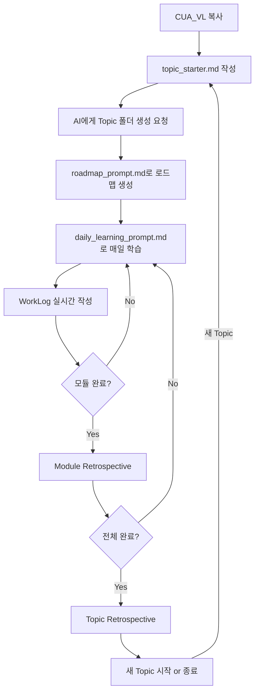

# CUA_VL 빠른 시작 가이드

**버전**: 2.0
**최종 업데이트**: 2025-12-28

---

## 🎯 CUA_VL이란?

**Catch Up AI Vibe Learning (CUA_VL)**는 AI와 함께 새로운 기술을 체계적으로 학습하고, 그 과정에서 생성된 산출물을 다른 학습자들이 활용할 수 있는 고품질 교과서로 만드는 학습 방법론입니다.

**핵심 철학**:
> "AI와 함께 배우고, 배운 것을 구조화하여, 다음 학습자를 위한 길을 만든다"

---

## 🚀 5분 만에 시작하기

### Step 1: CUA_VL 복사

```bash
# GitHub에서 복사
git clone https://github.com/solkit70/MCP_Basic_Higher_Models_GC.git
cd MCP_Basic_Higher_Models_GC/CUA_VL

# 또는 ZIP 다운로드 후 압축 해제
```

---

### Step 2: Topic 시작 파일 작성

**💡 추천 방법: AI와 대화하며 작성하기**

topic_starter.md 작성이 막막하다면, AI에게 아래 프롬프트를 사용하세요!

```
"[Topic 이름]을 배우고 싶은데, topic_starter.md 파일을 작성해줄 수 있어?
[기간]에 마치고 싶고, [목표]를 달성하고 싶어.

CUA_VL 방법론에 맞게 작성하려면 어떤 정보가 필요한지
선택형 질문(라디오 버튼/체크박스)으로 물어보면서 함께 작성해줘."
```

**예시**:
```
"Deep Agent 기술을 배우고 싶은데, topic_starter.md 파일을 작성해줄 수 있어?
2주 안에 마치고 싶고, 실제로 AI Application을 만들어보고 싶어.

CUA_VL 방법론에 맞게 작성하려면 어떤 정보가 필요한지
선택형 질문(라디오 버튼/체크박스)으로 물어보면서 함께 작성해줘."
```

**AI가 하는 일**:
1. **구조화된 질문 제시** (선택형으로 편하게 답변 가능)
   - 학습 목표가 무엇인가요? (체크박스)
   - 사전 지식 수준은 어느 정도인가요? (라디오 버튼)
   - 어떤 환경에서 학습하시나요? (체크박스)
   - 실습 프로젝트는 무엇인가요? (라디오 버튼)

2. **답변을 반영하여 topic_starter.md 작성**
   - 모든 섹션을 채운 완성된 파일 생성
   - CUA_VL 템플릿 형식에 맞게 구조화

3. **파일 저장**
   - `CUA_VL/templates/[YourTopic]_topic_starter.md`로 저장

**핵심 장점**:
- ✅ 라디오 버튼/체크박스로 빠른 선택
- ✅ AI가 필요한 정보를 체계적으로 수집
- ✅ 즉시 사용 가능한 완성된 파일 생성

**직접 작성하는 방법**:

```bash
# topic_starter.md 템플릿 복사
cp templates/topic_starter.md [YourTopic]_topic_starter.md

# 예시
cp templates/topic_starter.md Docker-Basics_topic_starter.md
```

**작성 예시**:
```markdown
## 📌 Topic 기본 정보
Topic 이름: Docker-Basics
설명: Docker 컨테이너 기술의 기본 개념과 실습
학습 목적: 개발 환경 컨테이너화로 생산성 향상
예상 기간: 2주

## 🎯 학습 목표
- [ ] Docker 이미지와 컨테이너 개념 이해
- [ ] Dockerfile 작성 능력
- [ ] docker-compose 활용 능력

## 🛠️ 학습 환경
OS: Windows 11
주요 도구:
- Docker Desktop
- VS Code
```

**핵심**: AI와 대화하며 작성하면 더 구체적이고 실현 가능한 학습 계획을 세울 수 있습니다!

---

### Step 3: AI에게 Topic 폴더 생성 요청

topic_starter.md를 완성했다면, AI에게 아래 프롬프트를 사용하세요!

**프롬프트 템플릿**:
```
"[YourTopic]_topic_starter.md 파일을 보고
CUA_VL 방법론에 맞는 Topic 폴더를 만들어주세요.

완료되면 다음 단계로 무엇을 하면 좋을지 안내해주세요."
```

**예시**:
```
"DeepAgent_topic_starter.md 파일을 보고
CUA_VL 방법론에 맞는 Topic 폴더를 만들어주세요.

완료되면 다음 단계로 무엇을 하면 좋을지 안내해주세요."
```

**AI가 하는 일**:
1. **Topic 폴더 구조 자동 생성**
   ```
   CUA_VL/Deep-Agent/
   ├── topic_info.md              # topic_starter 내용 복사
   ├── vl_prompts/
   │   ├── roadmap_prompt.md      # Topic 정보 주입된 프롬프트
   │   └── daily_learning_prompt.md
   ├── vl_roadmap/                # 로드맵 저장 위치
   ├── vl_worklog/                # 학습 일지 저장 위치
   └── vl_materials/              # 참조 자료 (선택)
   ```

2. **다음 단계 안내**
   - Roadmap 생성 방법 설명
   - 필요한 프롬프트 파일 경로 안내
   - 학습 시작 준비 확인

---

### Step 4: 학습 Roadmap 생성

Topic 폴더가 생성되었다면, AI에게 아래 프롬프트를 사용하세요!

**프롬프트 템플릿**:
```
"[TopicName]/vl_prompts/roadmap_prompt.md 파일을 읽고
학습 로드맵을 생성해주세요.

완료되면 다음 단계로 무엇을 하면 좋을지 안내해주세요."
```

**예시**:
```
"Deep-Agent/vl_prompts/roadmap_prompt.md 파일을 읽고
학습 로드맵을 생성해주세요.

완료되면 다음 단계로 무엇을 하면 좋을지 안내해주세요."
```

**AI가 하는 일**:
1. **학습 기간 적정성 검토** (STEP 1)
   - Topic 복잡도 분석
   - 사용자가 입력한 기간의 적정성 평가
   - 피드백 제공 (적정함/너무 짧음/너무 긺)
   - 사용자 확인 대기

2. **사용자 확인 후 로드맵 생성** (STEP 2)
   - 모듈별 학습 계획 수립
   - 각 모듈의 목표, 활동, DoD 정의
   - `vl_roadmap/YYYYMMDD_RoadMap_[Topic].md` 파일 생성

3. **다음 단계 안내**
   - 매일 학습 시작 방법
   - daily_learning_prompt.md 사용법

---

### Step 5: 매일 학습 시작

Roadmap이 준비되었다면, 매일 학습할 때 AI에게 아래 프롬프트를 사용하세요!

**프롬프트 템플릿**:
```
"[TopicName]/vl_prompts/daily_learning_prompt.md 파일을 읽고
오늘의 학습을 도와주세요.

현재 상황:
- Roadmap 파일: vl_roadmap/YYYYMMDD_RoadMap_[Topic].md
- 현재 모듈: M[N] - [모듈 이름]
- 최근 WorkLog: [파일명 또는 '없음 - 첫 세션']
- 사용 가능한 시간: [X시간]"
```

**예시**:
```
"Deep-Agent/vl_prompts/daily_learning_prompt.md 파일을 읽고
오늘의 학습을 도와주세요.

현재 상황:
- Roadmap 파일: vl_roadmap/20251228_RoadMap_Deep-Agent.md
- 현재 모듈: M1 - Deep Agent 개념
- 최근 WorkLog: 없음 - 첫 세션
- 사용 가능한 시간: 3시간"
```

**AI가 하는 일**:
1. **Roadmap 및 이전 WorkLog 분석**
   - 현재 모듈의 목표와 DoD 파악
   - 미완료 작업 확인

2. **오늘의 학습 계획 수립**
   - 우선순위 결정
   - 시간 배분 (버퍼 20%)
   - 구체적 활동 목록

3. **사용자 승인 후 학습 시작**
   - WorkLog 파일 생성 안내
   - 실시간 학습 지원
   - 질문 응답 및 디버깅

---

## 📖 전체 학습 흐름



---

## 📁 폴더 구조 이해

### CUA_VL 메인 폴더
```
CUA_VL/
├── README.md                    # 방법론 전체 설명
├── GETTING_STARTED.md          # 이 파일
├── templates/                  # 템플릿 파일들
│   ├── topic_starter.md        # Topic 시작 템플릿
│   ├── roadmap_prompt_template.md
│   └── daily_learning_prompt.md
├── CUA_VL_Development/         # CUA_VL 자체 개발 기록
└── [각 Topic 폴더들]/          # 학습한 Topic들
```

### Topic 폴더 구조
```
[TopicName]/
├── topic_info.md               # Topic 정보
├── vl_prompts/                 # 프롬프트 파일들
│   ├── roadmap_prompt.md
│   └── daily_learning_prompt.md
├── vl_roadmap/                 # 학습 로드맵
│   └── YYYYMMDD_RoadMap_[Topic].md
├── vl_worklog/                 # 학습 일지
│   ├── YYYYMMDD_M1_[Topic].md
│   ├── YYYYMMDD_M2_[Topic].md
│   └── ...
├── vl_materials/               # 참조 자료 (Optional)
└── 01-ModuleName/              # 학습 산출물
    ├── README.md
    ├── concepts/
    ├── examples/
    └── guides/
```

---

## 🎓 학습 프로세스 상세

### 1. Topic 시작 (1회)

**목표**: Topic 폴더 구조 생성 및 Roadmap 수립

1. **topic_starter.md 작성** (15-30분)
   - Topic 정보 입력
   - 학습 목표 설정
   - 환경 및 참조 자료 정리

2. **AI에게 폴더 생성 요청** (5분)
   - topic_starter.md 전달
   - Topic 폴더 자동 생성
   - 프롬프트 파일 준비

3. **Roadmap 생성** (30-60분)
   - roadmap_prompt.md 전달
   - AI가 모듈별 계획 생성
   - 검토 및 조정

---

### 2. 매일 학습 (반복)

**목표**: 계획 → 실행 → 기록 → 회고

#### 학습 시작 (10-15분)
1. **daily_learning_prompt.md 작성**
   - 현재 상황 정보 입력
   - 가용 시간 입력
   - AI에게 전달

2. **AI가 학습 계획 제시**
   - Roadmap 및 이전 WorkLog 분석
   - 오늘의 목표 및 활동 제안
   - 시간 배분 계획

3. **계획 승인**
   - 검토 및 조정 요청 (필요 시)
   - "시작합니다" 응답

#### 학습 진행 (1-3시간)
1. **WorkLog 파일 생성**
   - AI가 제공한 템플릿 사용
   - 실시간으로 작성

2. **활동 실행**
   - 개념 학습
   - 실습 진행
   - 산출물 생성

3. **진행 상황 추적**
   - 완료한 작업 체크
   - 문제 발생 시 기록
   - DoD 달성률 업데이트

#### 학습 종료 (10-15분)
1. **문서화**
   - 산출물 폴더 정리
   - README.md 작성

2. **Daily Retrospective**
   - What went well?
   - What could be improved?
   - Insights
   - Tomorrow's focus

3. **WorkLog 완성**
   - 최종 검토
   - Git commit (선택)

---

### 3. 모듈 완료 (모듈당 1회)

**목표**: 모듈 회고 및 다음 모듈 준비

1. **Module Retrospective 작성** (15-20분)
   - 계획 대비 실제 비교
   - 핵심 학습 내용 정리
   - Self-Assessment

2. **Roadmap 업데이트**
   - 모듈 완료 표시
   - 필요 시 후속 모듈 조정

---

### 4. Topic 완료 (Topic당 1회)

**목표**: 전체 회고 및 산출물 최종 정리

1. **Topic Retrospective 작성** (30-60분)
   - 전체 학습 여정 정리
   - 방법론 효과성 평가
   - 개선 사항 도출

2. **산출물 검증**
   - 교과서 품질 확인
   - 링크 및 예제 검증

3. **공유** (선택)
   - GitHub 공개
   - 커뮤니티 공유

---

## 💡 학습 팁

### ✅ Do's (권장)

1. **매일 WorkLog 작성**
   - 실시간으로 기록하면 회고가 쉬움
   - 문제 해결 과정 상세히 기록

2. **실습 우선**
   - 이론 30%, 실습 70%
   - "작은 성공" 경험 중요

3. **AI 적극 활용**
   - 막히면 즉시 질문
   - 코드 리뷰 요청
   - 디버깅 방향 제시

4. **산출물 품질 유지**
   - README.md는 필수
   - 다른 학습자가 이해할 수 있게

5. **회고 생략하지 않기**
   - Daily: 5-10분 투자
   - Module: 15-20분 투자
   - 학습 방법 자체를 개선

### ❌ Don'ts (지양)

1. **완벽주의**
   - 모든 디테일 암기 불필요
   - AI에게 지시할 수 있으면 충분

2. **문서만 작성**
   - 실습 없이 이론만 읽지 않기
   - 반드시 직접 실행

3. **계획 없이 진행**
   - daily_learning_prompt.md 건너뛰지 않기
   - 무작정 시작하면 비효율적

4. **산출물 누락**
   - 매 모듈 최소 1개 폴더 생성
   - 코드만 작성하고 문서화 생략하지 않기

---

## ❓ FAQ

### Q1. AI 없이도 사용 가능한가요?
**A**: **아니요, AI는 필수입니다.** CUA_VL의 "Vibe Learning"은 AI와의 협업을 핵심으로 합니다.

**왜 AI가 필수인가?**
- **Roadmap 생성**: AI가 Topic 정보를 분석하여 체계적인 학습 계획 수립
- **Daily Learning**: AI가 진행 상황을 파악하고 매일의 학습 계획 제시
- **실시간 학습 지원**: 막힐 때 즉시 질문하고 답변 받기
- **코드 리뷰 및 디버깅**: AI가 작성한 코드 검증 및 문제 해결 도움
- **WorkLog 작성 지원**: AI가 구조화된 기록 작성 가이드

**권장 AI 도구** (CLI 환경에서 동작하는 Vibe Coding Tool):

**IDE/에디터 통합 도구**:
- **Claude Code** (VS Code Extension) - 추천
- **Cursor AI** (AI 통합 에디터)
- **GitHub Copilot** (VS Code, Cursor 등)
- **Cline** (VS Code Extension)

**Terminal/CLI 도구**:
- **Claude Code CLI** (터미널에서 Claude 사용)
- **GitHub Copilot CLI**
- **OpenAI Codex CLI**

**웹 기반 (보조)**:
- Claude.ai, ChatGPT (복사/붙여넣기 방식, 비효율적)

**중요**: 코드와 파일을 직접 읽고 쓸 수 있는 **CLI 환경 통합 AI 도구**를 사용해야 CUA_VL의 효율성을 최대화할 수 있습니다. 웹 기반 AI만 사용하면 복사/붙여넣기로 인한 시간 낭비가 발생합니다.

AI 없이는 CUA_VL의 핵심 가치인 "효율적 학습"과 "AI 시대 학습법"을 경험할 수 없습니다.

### Q2. 어떤 Topic에 적합한가요?
**A**: 학습 목표를 설정하고 체계적으로 접근할 수 있는 모든 Topic에 적합합니다.

**기술/실습 중심 Topic** (최적):
- ✅ 프로그래밍: Python, JavaScript, Rust 등
- ✅ 프레임워크: React, FastAPI, Django 등
- ✅ 도구: Docker, Git, MCP 등
- ✅ 기술: 클라우드, 데이터베이스, 네트워크 등

**이론/인문학 Topic** (가능):
- ✅ 철학, 역사, 문학 등
- ✅ 경영학, 경제학 등
- ✅ 언어 학습 (영어, 프랑스어 등)

**핵심**: CUA_VL은 Topic의 종류보다 **AI와 함께 체계적으로 학습**하는 것이 중요합니다. 실습이 없는 이론 과목이라도 AI와 대화하며 개념을 정리하고, WorkLog로 학습 과정을 기록하면 효과적입니다.

### Q3. 학습 기간은 어떻게 정하나요?
**A**: **사용자가 직접 설정**하되, **AI가 적정성을 검토**해줍니다.

**기간 설정 프로세스**:
1. **사용자가 topic_starter.md에 희망 기간 입력**
   - 예: "2주", "1개월", "3일" 등

2. **AI가 로드맵 생성 전 적정성 분석**
   - Topic 복잡도 평가 (간단/중간/복잡)
   - 사전 지식 수준 고려
   - 학습 목표 범위 확인

3. **AI가 피드백 제공**
   - ✅ 적정함: 그대로 진행
   - ⚠️ 너무 짧음: 기간 연장 또는 범위 축소 제안
   - ⚠️ 너무 긺: 기간 단축 또는 심화 내용 추가 제안

4. **사용자가 최종 결정**
   - "그대로 진행" / "기간 조정" / "범위 조정" 선택

**일반적인 기간 가이드** (참고용):
- **간단한 Topic** (CLI 도구, 기본 개념): 3-7일
- **중간 복잡도** (프레임워크, 라이브러리): 2-4주
- **복잡한 Topic** (대규모 시스템, 다중 기술): 1-3개월

**핵심**: CUA_VL은 사용자의 일정에 맞춰 **유연하게 조정**됩니다. AI가 적정성을 체크해주므로 안심하고 원하는 기간을 설정하세요!

### Q4. 혼자 사용해도 되나요?
**A**: 네! CUA_VL은 개인 학습에 최적화되어 있습니다. 팀으로 사용하면 산출물 공유로 더 큰 시너지를 낼 수 있습니다.

### Q5. Git이 필수인가요?
**A**: 필수는 아니지만 강력히 권장합니다.
- 버전 관리
- 산출물 백업
- 커뮤니티 공유

### Q6. 여러 Topic을 동시에 학습할 수 있나요?
**A**: 가능하지만 비권장입니다. 한 번에 하나의 Topic에 집중하는 것이 효과적입니다.

### Q7. 영어나 다른 언어로도 사용할 수 있나요?
**A**: 네! CUA_VL은 **다국어를 완벽하게 지원**합니다.

**현재 상태**:
- 🇰🇷 **한국어**: 현재 버전 (v2.0)
- 🇬🇧 **영어**: 완성 후 영어 버전 제공 예정
- 🌍 **기타 언어**: 사용자가 원하는 언어로 구성 가능

**AI의 다국어 장점 활용**:
- AI는 거의 모든 언어를 이해하고 생성 가능
- 프롬프트, Roadmap, WorkLog 모두 원하는 언어로 작성
- 언어를 바꿔도 방법론 구조는 동일

**사용 방법**:
1. **템플릿 번역**: `templates/` 폴더의 파일들을 원하는 언어로 번역
2. **AI에게 언어 지정**: "이 Topic은 영어로 진행하겠습니다" 명시
3. **일관성 유지**: 한 Topic 내에서는 동일 언어 사용 권장

**예시**:
```markdown
# topic_starter.md (English version)
Topic Name: Docker-Basics
Description: Learning Docker container fundamentals
Learning Period: 2 weeks
...
```

CUA_VL은 **글로벌 학습자 모두가 사용**할 수 있는 방법론입니다!

### Q8. topic_starter.md 수동으로 폴더 만들어도 되나요?
**A**: 네! AI 도움 없이 직접 폴더 구조를 만드셔도 됩니다. 단, templates의 파일들을 복사하고 Topic 정보를 직접 주입해야 합니다.

---

## 🛠️ 필수 도구

### AI 어시스턴트 (필수)
- **Claude** (추천): Claude Code, Claude.ai
- **ChatGPT**: GPT-4 이상 권장
- **기타**: GitHub Copilot, Cursor 등

### 텍스트 에디터 (필수)
- **VS Code** (추천): Markdown 지원 우수
- **Cursor**: AI 통합 에디터
- **기타**: Obsidian, Typora 등

### 버전 관리 (권장)
- **Git**: 학습 과정 버전 관리
- **GitHub**: 산출물 공유 및 백업

---

## 📚 더 알아보기

### 상세 문서
- [CUA_VL README.md](README.md): 방법론 전체 설명
- [topic_starter.md](templates/topic_starter.md): Topic 시작 템플릿
- [roadmap_prompt_template.md](templates/roadmap_prompt_template.md): Roadmap 생성 가이드
- [daily_learning_prompt.md](templates/daily_learning_prompt.md): 매일 학습 가이드

### 예시 (참고)
- `CUA_VL_Development/`: CUA_VL 자체 개발 과정 (메타 학습)
- 각 Topic 폴더: 실제 학습 결과물

---

## 💬 커뮤니티 및 지원

### 문의 및 피드백
- **Email**: solkit70@gmail.com
- **YouTube**: https://www.youtube.com/@catchupai/
- **GitHub**: https://github.com/solkit70/MCP_Basic_Higher_Models_GC.git

### 기여하기
- 개선 제안: GitHub Issues
- 예시 Topic 공유: Pull Request
- 방법론 개선 아이디어: Discussions

---

## 🎉 시작할 준비 되셨나요?

1. ✅ CUA_VL 복사 완료
2. ✅ README.md 읽고 방법론 이해
3. ✅ 이 가이드로 빠른 시작 방법 파악
4. 🚀 **이제 topic_starter.md를 작성하고 첫 Topic을 시작하세요!**

---

**행운을 빕니다! Happy Vibe Learning! 🎓**

---

**버전**: 2.0
**최종 업데이트**: 2025-12-28
**Created by**: CUA_VL Methodology
